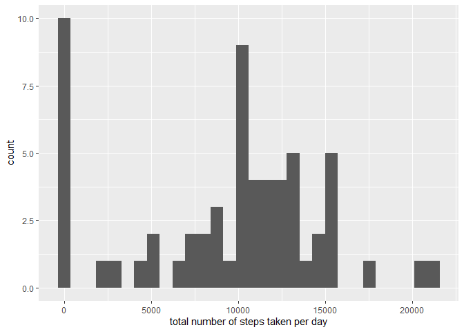
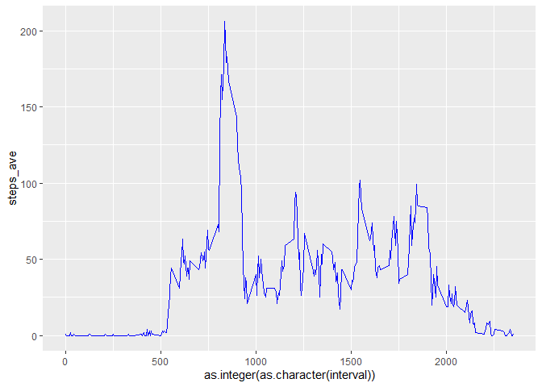
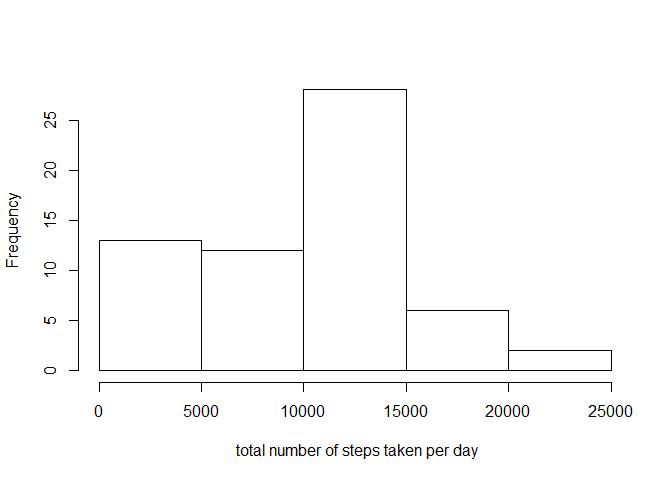
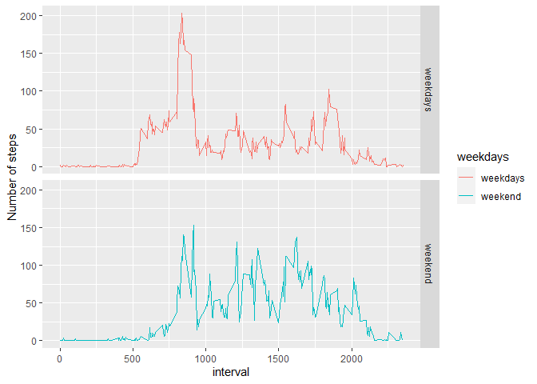

## Loading and preprocessing the data

```r
unzip("activity.zip", exdir = "activity Dataset")
files <- list.files("activity Dataset", full.names = TRUE)
dat <- read.csv("activity Dataset/activity.csv",header = TRUE)
```

## What is mean total number of steps taken per day?

```r
date <- character()
steps_sum <- integer()
count <- 288
for (i in 0:60) {
    date[i+1] <- as.character(dat$date[i*count + 1])
    steps_sum[i+1] <- sum(dat$steps[(i*count + 1):(i*count + 288)], na.rm = TRUE)
}
dat1 <- data.frame(date = date, steps_sum = steps_sum)
hist(dat1$steps_sum, xlab = " total number of steps taken per day", main = NA)
```

<!-- -->

```r
summary(dat1$steps_sum)
```

```
##    Min. 1st Qu.  Median    Mean 3rd Qu.    Max. 
##       0    6778   10395    9354   12811   21194
```

## What is the average daily activity pattern?

```r
library(dplyr)
```

```
## 
## Attaching package: 'dplyr'
```

```
## The following objects are masked from 'package:stats':
## 
##     filter, lag
```

```
## The following objects are masked from 'package:base':
## 
##     intersect, setdiff, setequal, union
```

```r
interval <- vector()
steps_ave <- vector()
for (i in 1:length(unique(dat$interval))) {
    interval[i] <- as.character(dat$interval[i])
    steps_ave[i] <- as.integer(mean(filter(dat, dat$interval == unique(dat$interval)[i])[,1], na.rm = TRUE))
}
dat2 <- data.frame(interval = interval, steps_ave = steps_ave)
plot(steps_ave ~ interval, data = dat2, type = "l")
```

<!-- -->

On average across all the days in the dataset, interval at 835 contains the maximum number of steps

## Imputing missing values
The total number of missing values in the dataset is

```r
sum(is.na(dat$steps))
```

```
## [1] 2304
```

```r
steps_ave <-integer()
for (i in 1:length(dat1$steps_sum)) {
     steps_ave[i] <- dat1[,2][i]/61
}
dat1 <- mutate(dat1, steps_ave = as.integer(steps_ave))
dat_new <- dat
for (i in 1:length(dat_new$steps)) {
    if (is.na(dat_new[i,1]) == TRUE) {
        dat_new[i,1] <- filter(dat1, as.character(dat1[,1]) == as.character(dat_new[i,2]))[,3]
    } 
}
date <- character()
steps_sum <- integer()
count <- 288
for (i in 0:60) {
    date[i+1] <- as.character(dat_new$date[i*count + 1])
    steps_sum[i+1] <- sum(dat_new$steps[(i*count + 1):(i*count + 288)], na.rm = TRUE)
}
dat_new1 <- data.frame(date = date, steps_sum = steps_sum)
hist(dat_new1$steps_sum, xlab = " total number of steps taken per day", main = NA)
```

<!-- -->

```r
summary(dat_new1$steps_sum)
```

```
##    Min. 1st Qu.  Median    Mean 3rd Qu.    Max. 
##       0    6778   10395    9354   12811   21194
```
## Are there differences in activity patterns between weekdays and weekends?

```r
weekdays <- vector()
for (i in 1:length(dat_new$date)) {
     if (weekdays(as.Date(dat_new$date[i])) == "Saturday" | weekdays(as.Date(dat_new$date[i])) == "Sunday") {
         weekdays[i] <- "weekend"
     } else {
         weekdays[i] <- "weekdays"
     }
}
dat_new <- mutate(dat_new, weekdays = weekdays)
steps_mean <- vector()
for (i in 1:length(dat_new$steps)) {
     steps_mean[i] <- filter(dat2, as.character(dat2$interval) == as.character(dat_new[i,3]))[,2]
}
dat_new <- mutate(dat_new, steps_mean = steps_mean)
library(ggplot2)
g <- ggplot(dat_new, aes(x = interval, y =  steps_mean))
g + geom_line() + facet_grid(weekdays ~ .) + labs(y = "Number of steps")
```

<!-- -->
